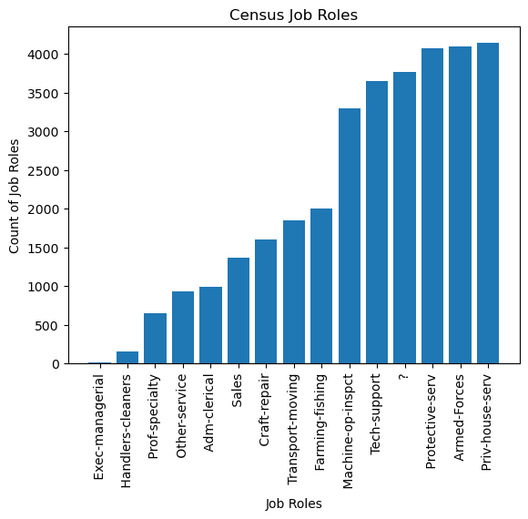
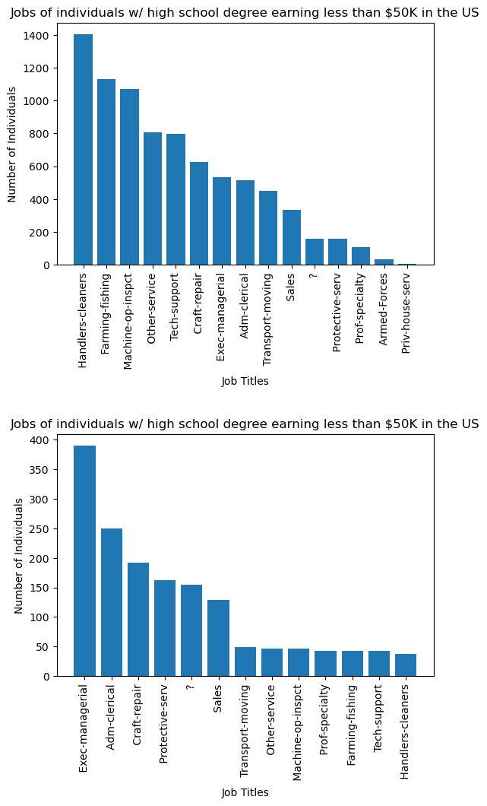

<h3> Mock Interview Python Screening test </h3>


```python
import pandas as pd
import matplotlib as mpl
import matplotlib.pyplot as plt
dataframe = pd.read_csv("/Users/christopherkonopka/Desktop/Data Analytics/Python Take Home/Mock Interview Python Exercise/adult_census_data.csv")
```


```python
dataframe.head()
```


<div>
<style scoped>
    .dataframe tbody tr th:only-of-type {
        vertical-align: middle;
    }

    .dataframe tbody tr th {
        vertical-align: top;
    }

    .dataframe thead th {
        text-align: right;
    }
</style>
<table border="1" class="dataframe">
  <thead>
    <tr style="text-align: right;">
      <th></th>
      <th>39</th>
      <th>State-gov</th>
      <th>77516</th>
      <th>Bachelors</th>
      <th>13</th>
      <th>Never-married</th>
      <th>Adm-clerical</th>
      <th>Not-in-family</th>
      <th>White</th>
      <th>Male</th>
      <th>2174</th>
      <th>0</th>
      <th>40</th>
      <th>United-States</th>
      <th>&lt;=50K</th>
    </tr>
  </thead>
  <tbody>
    <tr>
      <th>0</th>
      <td>50</td>
      <td>Self-emp-not-inc</td>
      <td>83311</td>
      <td>Bachelors</td>
      <td>13</td>
      <td>Married-civ-spouse</td>
      <td>Exec-managerial</td>
      <td>Husband</td>
      <td>White</td>
      <td>Male</td>
      <td>0</td>
      <td>0</td>
      <td>13</td>
      <td>United-States</td>
      <td>&lt;=50K</td>
    </tr>
    <tr>
      <th>1</th>
      <td>38</td>
      <td>Private</td>
      <td>215646</td>
      <td>HS-grad</td>
      <td>9</td>
      <td>Divorced</td>
      <td>Handlers-cleaners</td>
      <td>Not-in-family</td>
      <td>White</td>
      <td>Male</td>
      <td>0</td>
      <td>0</td>
      <td>40</td>
      <td>United-States</td>
      <td>&lt;=50K</td>
    </tr>
    <tr>
      <th>2</th>
      <td>53</td>
      <td>Private</td>
      <td>234721</td>
      <td>11th</td>
      <td>7</td>
      <td>Married-civ-spouse</td>
      <td>Handlers-cleaners</td>
      <td>Husband</td>
      <td>Black</td>
      <td>Male</td>
      <td>0</td>
      <td>0</td>
      <td>40</td>
      <td>United-States</td>
      <td>&lt;=50K</td>
    </tr>
    <tr>
      <th>3</th>
      <td>28</td>
      <td>Private</td>
      <td>338409</td>
      <td>Bachelors</td>
      <td>13</td>
      <td>Married-civ-spouse</td>
      <td>Prof-specialty</td>
      <td>Wife</td>
      <td>Black</td>
      <td>Female</td>
      <td>0</td>
      <td>0</td>
      <td>40</td>
      <td>Cuba</td>
      <td>&lt;=50K</td>
    </tr>
    <tr>
      <th>4</th>
      <td>37</td>
      <td>Private</td>
      <td>284582</td>
      <td>Masters</td>
      <td>14</td>
      <td>Married-civ-spouse</td>
      <td>Exec-managerial</td>
      <td>Wife</td>
      <td>White</td>
      <td>Female</td>
      <td>0</td>
      <td>0</td>
      <td>40</td>
      <td>United-States</td>
      <td>&lt;=50K</td>
    </tr>
  </tbody>
</table>
</div>


<b> Q1. After importing the adult_census_data.csv file, please filter this to include only the following criteria: </b>
<p>

<li> State-Gov</li>
<li> Bachelors </li>
<li> Never-Married </li>
<li> Adm-Clerical </li> 
<li> Not-in-familiy </li>
<li> White </li>
<li> Male </li> 
<li> United States </li>
<li> <=50K </li> 

<b> Feel free to any method to complete this tasks. However, we recommend you use either list filtering [], or .loc to complete this task.</b>

<b> Put your code below </b>


```python
census = dataframe.iloc[:,[1,3, 5, 6, 7, 8, 9, 13, 14]]
print(census.head())
```

               State-gov   Bachelors        Never-married        Adm-clerical  \
    0   Self-emp-not-inc   Bachelors   Married-civ-spouse     Exec-managerial   
    1            Private     HS-grad             Divorced   Handlers-cleaners   
    2            Private        11th   Married-civ-spouse   Handlers-cleaners   
    3            Private   Bachelors   Married-civ-spouse      Prof-specialty   
    4            Private     Masters   Married-civ-spouse     Exec-managerial   
    
        Not-in-family   White     Male   United-States   <=50K  
    0         Husband   White     Male   United-States   <=50K  
    1   Not-in-family   White     Male   United-States   <=50K  
    2         Husband   Black     Male   United-States   <=50K  
    3            Wife   Black   Female            Cuba   <=50K  
    4            Wife   White   Female   United-States   <=50K  


<b> Currently, the dataframe you are using has the following column names: </b>

[' State-gov', ' Bachelors', ' Never-married',
       ' Adm-clerical', ' Not-in-family', ' White', ' Male', ' United-States', ' <=50K']
       
     
<b> Q2. Please re-name all the newly filtered columns in the pandas DataFrame to the following: </b>

Employment Type, Degree Status, Marriage-Status, Job-Role, Family-Role, Ethnicity, Gender, Country, Earnings

E.g. State-Gov becomes Employment Type, Bachelors becomes Degree Status, etc.

<b> Put your code below </b>


```python
census.columns = ["Employment_Type", "Degree Status", "Marriage-Status", "Job-Role", "Family-Role", "Ethnicity", "Gender", "Country", "Earnings"]
print(census)
```

             Employment_Type Degree Status      Marriage-Status  \
    0       Self-emp-not-inc     Bachelors   Married-civ-spouse   
    1                Private       HS-grad             Divorced   
    2                Private          11th   Married-civ-spouse   
    3                Private     Bachelors   Married-civ-spouse   
    4                Private       Masters   Married-civ-spouse   
    ...                  ...           ...                  ...   
    32555            Private    Assoc-acdm   Married-civ-spouse   
    32556            Private       HS-grad   Married-civ-spouse   
    32557            Private       HS-grad              Widowed   
    32558            Private       HS-grad        Never-married   
    32559       Self-emp-inc       HS-grad   Married-civ-spouse   
    
                     Job-Role     Family-Role Ethnicity   Gender         Country  \
    0         Exec-managerial         Husband     White     Male   United-States   
    1       Handlers-cleaners   Not-in-family     White     Male   United-States   
    2       Handlers-cleaners         Husband     Black     Male   United-States   
    3          Prof-specialty            Wife     Black   Female            Cuba   
    4         Exec-managerial            Wife     White   Female   United-States   
    ...                   ...             ...       ...      ...             ...   
    32555        Tech-support            Wife     White   Female   United-States   
    32556   Machine-op-inspct         Husband     White     Male   United-States   
    32557        Adm-clerical       Unmarried     White   Female   United-States   
    32558        Adm-clerical       Own-child     White     Male   United-States   
    32559     Exec-managerial            Wife     White   Female   United-States   
    
          Earnings  
    0        <=50K  
    1        <=50K  
    2        <=50K  
    3        <=50K  
    4        <=50K  
    ...        ...  
    32555    <=50K  
    32556     >50K  
    32557    <=50K  
    32558    <=50K  
    32559     >50K  
    
    [32560 rows x 9 columns]


<b> Q3. The Job Role Columns holds the job information for each individual in this census snapshot. Using this column, create a Bar Chart that shows the count of 'Unique' Jobs per Job Group in the "Job-Role" Column in ascending order, as per the provided image below </b>


<b> Put your code below </b>


```python
jobs = census['Job-Role'].unique().tolist()
jobs_count = census['Job-Role'].value_counts(ascending=True)

plt.xlabel("Job Roles")
plt.ylabel("Count of Job Roles")
plt.title("Census Job Roles")

plt.xticks(rotation=90)

plt.bar(jobs, jobs_count)
plt.show()
```


    

    


<b> Q4. Please create two bar plots as per below that show:
    
    1) The number of individuals who have a High School Graduate Diploma AND earn <=50K in the United States
    2) The number of individuals who have a High School Graduate Diploma AND earn >50K in the United States 

Please note you will be looking specifically at the *Job Role* column

<b> Put Your Code Below </b>


```python
print(census)
```

             Employment_Type Degree Status      Marriage-Status  \
    0       Self-emp-not-inc     Bachelors   Married-civ-spouse   
    1                Private       HS-grad             Divorced   
    2                Private          11th   Married-civ-spouse   
    3                Private     Bachelors   Married-civ-spouse   
    4                Private       Masters   Married-civ-spouse   
    ...                  ...           ...                  ...   
    32555            Private    Assoc-acdm   Married-civ-spouse   
    32556            Private       HS-grad   Married-civ-spouse   
    32557            Private       HS-grad              Widowed   
    32558            Private       HS-grad        Never-married   
    32559       Self-emp-inc       HS-grad   Married-civ-spouse   
    
                     Job-Role     Family-Role Ethnicity   Gender         Country  \
    0         Exec-managerial         Husband     White     Male   United-States   
    1       Handlers-cleaners   Not-in-family     White     Male   United-States   
    2       Handlers-cleaners         Husband     Black     Male   United-States   
    3          Prof-specialty            Wife     Black   Female            Cuba   
    4         Exec-managerial            Wife     White   Female   United-States   
    ...                   ...             ...       ...      ...             ...   
    32555        Tech-support            Wife     White   Female   United-States   
    32556   Machine-op-inspct         Husband     White     Male   United-States   
    32557        Adm-clerical       Unmarried     White   Female   United-States   
    32558        Adm-clerical       Own-child     White     Male   United-States   
    32559     Exec-managerial            Wife     White   Female   United-States   
    
          Earnings  
    0        <=50K  
    1        <=50K  
    2        <=50K  
    3        <=50K  
    4        <=50K  
    ...        ...  
    32555    <=50K  
    32556     >50K  
    32557    <=50K  
    32558    <=50K  
    32559     >50K  
    
    [32560 rows x 9 columns]


```python
hsunder50 = census[(census["Degree Status"].str.strip() == "HS-grad") & (census["Earnings"].str.strip() == "<=50K") & (census["Country"].str.strip() == "United-States") ]
hsover50 = census[(census["Degree Status"].str.strip() == "HS-grad") & (census["Earnings"].str.strip() == ">50K") & (census["Country"].str.strip() == "United-States") ]
print(hsunder50)
print(hsover50)


```

             Employment_Type Degree Status      Marriage-Status  \
    1                Private       HS-grad             Divorced   
    15      Self-emp-not-inc       HS-grad        Never-married   
    16               Private       HS-grad        Never-married   
    20               Private       HS-grad            Separated   
    23               Private       HS-grad             Divorced   
    ...                  ...           ...                  ...   
    32539          State-gov       HS-grad            Separated   
    32540                  ?       HS-grad            Separated   
    32541                  ?       HS-grad   Married-civ-spouse   
    32557            Private       HS-grad              Widowed   
    32558            Private       HS-grad        Never-married   
    
                     Job-Role     Family-Role Ethnicity   Gender         Country  \
    1       Handlers-cleaners   Not-in-family     White     Male   United-States   
    15        Farming-fishing       Own-child     White     Male   United-States   
    16      Machine-op-inspct       Unmarried     White     Male   United-States   
    20          Other-service       Unmarried     Black   Female   United-States   
    23           Tech-support       Unmarried     White   Female   United-States   
    ...                   ...             ...       ...      ...             ...   
    32539        Adm-clerical       Own-child     White   Female   United-States   
    32540                   ?   Not-in-family     Black   Female   United-States   
    32541                   ?         Husband     White     Male   United-States   
    32557        Adm-clerical       Unmarried     White   Female   United-States   
    32558        Adm-clerical       Own-child     White     Male   United-States   
    
          Earnings  
    1        <=50K  
    15       <=50K  
    16       <=50K  
    20       <=50K  
    23       <=50K  
    ...        ...  
    32539    <=50K  
    32540    <=50K  
    32541    <=50K  
    32557    <=50K  
    32558    <=50K  
    
    [8119 rows x 9 columns]
             Employment_Type Degree Status      Marriage-Status  \
    6       Self-emp-not-inc       HS-grad   Married-civ-spouse   
    66               Private       HS-grad   Married-civ-spouse   
    83               Private       HS-grad             Divorced   
    85             Local-gov       HS-grad   Married-civ-spouse   
    104         Self-emp-inc       HS-grad   Married-civ-spouse   
    ...                  ...           ...                  ...   
    32414   Self-emp-not-inc       HS-grad   Married-civ-spouse   
    32461       Self-emp-inc       HS-grad   Married-civ-spouse   
    32517          Local-gov       HS-grad   Married-civ-spouse   
    32556            Private       HS-grad   Married-civ-spouse   
    32559       Self-emp-inc       HS-grad   Married-civ-spouse   
    
                     Job-Role     Family-Role Ethnicity   Gender         Country  \
    6         Exec-managerial         Husband     White     Male   United-States   
    66           Adm-clerical            Wife     White   Female   United-States   
    83           Craft-repair   Not-in-family     White   Female   United-States   
    85        Protective-serv         Husband     White     Male   United-States   
    104          Craft-repair         Husband     White     Male   United-States   
    ...                   ...             ...       ...      ...             ...   
    32414        Craft-repair         Husband     White     Male   United-States   
    32461        Craft-repair         Husband     White     Male   United-States   
    32517        Craft-repair         Husband     White     Male   United-States   
    32556   Machine-op-inspct         Husband     White     Male   United-States   
    32559     Exec-managerial            Wife     White   Female   United-States   
    
          Earnings  
    6         >50K  
    66        >50K  
    83        >50K  
    85        >50K  
    104       >50K  
    ...        ...  
    32414     >50K  
    32461     >50K  
    32517     >50K  
    32556     >50K  
    32559     >50K  
    
    [1583 rows x 9 columns]


```python
jobsunder50 = hsunder50['Job-Role'].unique().tolist()
jobs_count_under50 = hsunder50['Job-Role'].value_counts()

jobsover50 = hsover50['Job-Role'].unique().tolist()
jobs_count_over50 = hsover50['Job-Role'].value_counts()

plt.subplot(2, 1, 1) # row 1, col 2 index 1
plt.bar(jobsunder50, jobs_count_under50)
plt.title("Jobs of individuals w/ high school degree earning less than $50K in the US")
plt.xlabel('Job Titles')
plt.ylabel('Number of Individuals')
plt.xticks(rotation=90)

plt.subplot(2, 1, 2) # index 2
plt.bar(jobsover50, jobs_count_over50)
plt.title("Jobs of individuals w/ high school degree earning less than $50K in the US")
plt.xlabel('Job Titles')
plt.ylabel('Number of Individuals')
plt.xticks(rotation=90)

plt.subplots_adjust(top=1.9, hspace=0.7)

plt.show()


```


    

    


